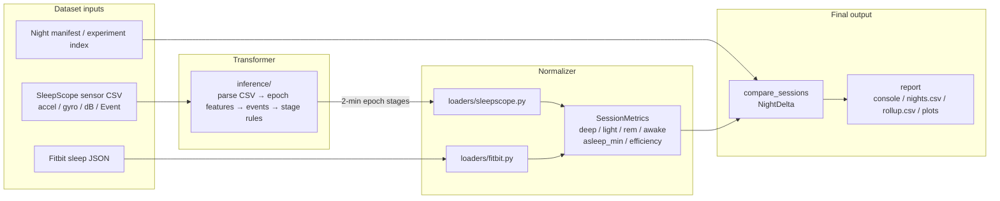

# Sleep Analyzer

Compare **SleepScope** smartphone sensor recordings with wearable providers on session-level stage metrics.

v1 supports **Fitbit** only. The comparison core uses a shared normalized schema so additional providers (Oura, Garmin, …) can be added as loaders without changing manifests or rollup logic.

## Research question

Can a smartphone app using phone sensors track sleep quality comparably to wearables?

## Pipeline



SleepScope always starts as raw phone-sensor CSV. Inference transforms that into 2-minute stage epochs, then both sides normalize into `SessionMetrics` before comparison and reporting.

Optional: `python infer.py sensor.csv --out epochs.json` writes the intermediate epoch JSON for inspection; compare manifests should still point at the CSV.

## Canonical stages

Both sides map into:

| Canonical | SleepScope inferred `state` | Fitbit |
| --- | --- | --- |
| deep | `Deep` | `deep` |
| light | `Light` | `light` |
| rem | `REM` | `rem` |
| awake | `Awake` | `wake` / `awake` |

Derived metrics:

- `asleep_min = deep + light + rem`
- `efficiency = asleep_min / duration_min`

## Setup

```bash
python3 -m venv .venv
source .venv/bin/activate
pip install -r requirements.txt
```

## Night manifest

Each paired night is one JSON file:

```json
{
  "id": "2026-07-08-fitbit",
  "date": "2026-07-08",
  "notes": "optional",
  "reference": {
    "provider": "sleepscope",
    "path": "../raw/2026-07-08/sensor.csv"
  },
  "comparisons": [
    {
      "provider": "fitbit",
      "path": "../raw/2026-07-08/fitbit_sleep.json"
    }
  ]
}
```

Rules:

- `reference.provider` must be `sleepscope`
- `reference.path` must be a SleepScope sensor **CSV**
- v1 requires exactly one entry in `comparisons`
- Paths are relative to the manifest file (or absolute)

### Experiment index

```json
{
  "name": "sleepscope-vs-wearables",
  "nights": [
    "nights/2026-07-08-fitbit.json",
    "nights/2026-07-09-fitbit.json"
  ]
}
```

## CLI

```bash
python infer.py path/to/sensor.csv --out path/to/epochs.json
python compare.py data/nights/2026-07-08-fitbit.json
python compare.py data/experiment.json --out results/nights.csv --rollup-out results/rollup.csv
python compare.py data/nights/ --out results/nights.csv --plots results/plots
```

Primary rollup endpoints: **deep**, **REM**, and **efficiency** (bias, MAE, RMSE, Pearson/Spearman). Correlations are marked exploratory until `n >= 10`.

## Expected export shapes

### SleepScope

Prototype phone-sensor CSV with `# key=value` metadata headers:

```csv
# participant=ALEX,,,,,,,,
# started=2026-07-16T01:28:25.293Z,,,,,,,,
Timestamp,Accel_X,Accel_Y,Accel_Z,Gyro_X,Gyro_Y,Gyro_Z,dB,Event
2026-07-16T01:28:25.350Z,-0.15,-0.82,-0.61,-0.02,0.07,-0.18,-57.9,
2026-07-16T01:28:57.855Z,-0.00,-0.81,-0.59,-0.01,0.00,-0.01,-52.6,awake_in_bed
# note=optional,,,,,,,,
```

### Fitbit

Google Takeout / Web API sleep JSON. Preferred fields: `levels.summary` stage minutes, else `levels.data`, plus `startTime` / `endTime` / `timeInBed`.

## Adding a provider later

1. Create `sleep_analyzer/loaders/<name>.py` that maps the export into `SessionMetrics`
2. Call `register_loader(YourLoader())` at module import time
3. Import the module from `sleep_analyzer/loaders/__init__.py`
4. Use `"provider": "<name>"` in `comparisons`

No changes to the night manifest schema or comparison/report code are required.

## Tests

```bash
pip install -r requirements.txt
python -m pytest -q
```
