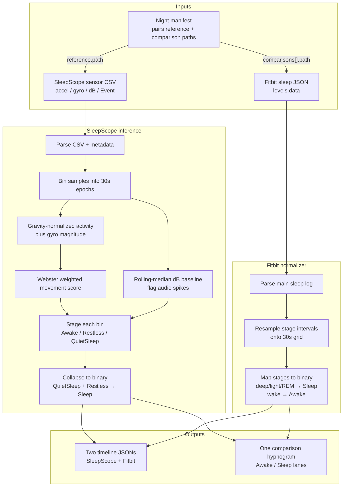

# Sleep Analyzer

Compare **SleepScope** phone-sensor recordings with **Fitbit** as binary **Sleep vs Awake** timelines.

## Pipeline



## Outputs

1. **Two timeline JSON files** — SleepScope and Fitbit, each a sequence of 30s `{timestamp, state}` where `state` is `Sleep` or `Awake`
2. **One hypnogram PNG** — condensed two-lane chart (Awake / Sleep) with SleepScope and Fitbit in different colors

## Setup

```bash
python3 -m venv .venv
source .venv/bin/activate
pip install -r requirements.txt
```

## Night manifest

```json
{
  "id": "2026-07-12-fitbit",
  "date": "2026-07-12",
  "reference": {
    "provider": "sleepscope",
    "path": "../raw/2026-07-12/sensor.csv"
  },
  "comparisons": [
    {
      "provider": "fitbit",
      "path": "../raw/2026-07-12/fitbit_sleep.json"
    }
  ]
}
```

## CLI

```bash
python compare.py data/nights/example-fitbit.json
```

Timelines and hypnograms write to `results/timelines` and `results/plots` by default. Override with `--out` / `--plots` if needed.
## Tests

```bash
python -m pytest -q
```
